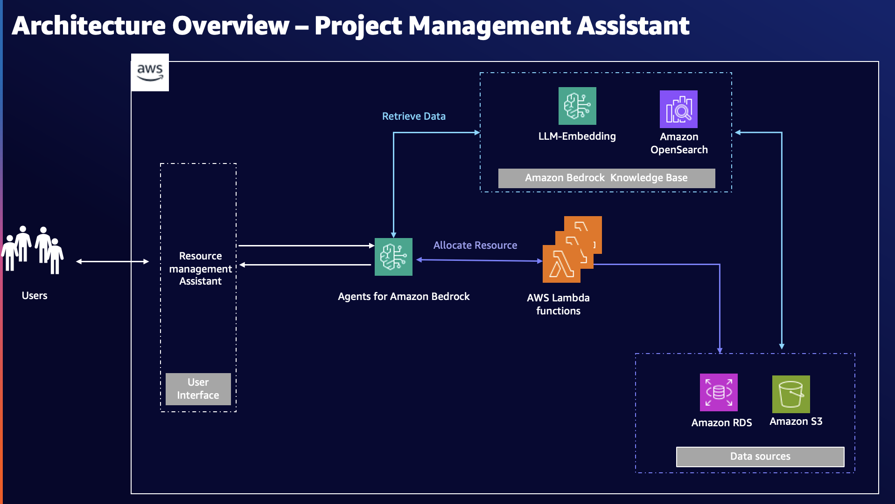
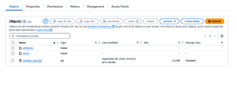
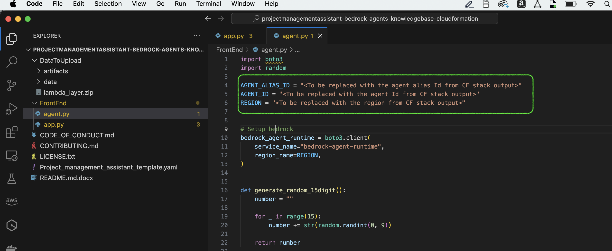
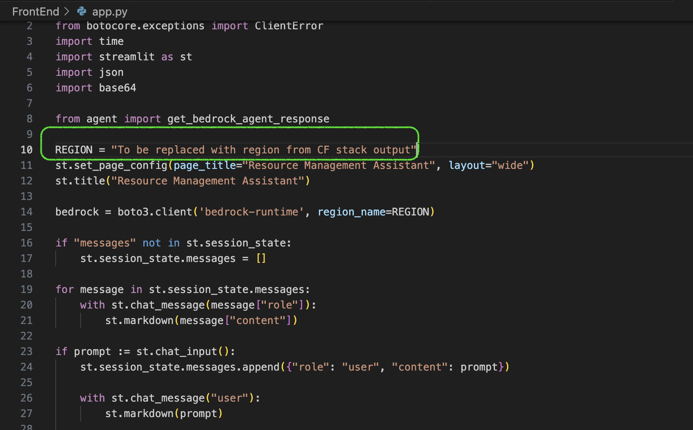
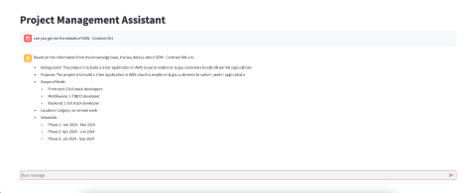

# Project Management Assistant


The sample code in this repo aims to build a sample Project Management Assistant application using Amazon Bedrock - [**Agents for Amazon Bedrock**](https://aws.amazon.com/bedrock/agents/) and [**Knowledge Base for Amazon Bedrock**](https://aws.amazon.com/bedrock/knowledge-bases/). Project managers spend a 1/3rd of their day in project management activities like resource allocation, task creation and scanning through internal data sources for project or organization specific information. This use case can be made efficient by leveraging the power of LLM and employing a RAG and agent-based serverless solution.

Project Management Assistant is an interactive chat application, aimed to act as an assistant for project managers. In this repository, we are focussing on building 2 core functionalities of Project Management Assistant, which are given below:
1)	Interactive search – Ability to search on internal data sources
2)	Resource allocation - Ability to assign resources to projects
    
Project Management Assistant is built using a serverless architecture and primarily built on Amazon Bedrock. Architectural consideration for this design includes simplified development process. Bedrock being a fully managed service takes away the burden of managing the infrastructure, provisioning capacity, or writing custom code and also it makes the development process simple with easy-to-use features to handle security & compliance, prompt engineering, monitoring, encryption, user permissions, API invocation and more. 

## Architecture Overview
 
 

Let’s take quick look at the components of the architecture. 

### User interface 
You can build a UI application to act as the entry point for Project Management Assistant solution.  Alternatively, you can integrate the solution to your existing applications or build a slack integration to serve as slack bot.


### Agents for Amazon Bedrock  
Orchestration is the brain of this solution and is implemented using [**Agents for Amazon Bedrock**](https://aws.amazon.com/bedrock/agents/). Agents for Amazon Bedrock is one of the key features of Bedrock that enables you to build and configure autonomous agents for your application. 
Following are the responsibilities of the agent in this solution: 
1)	Breaking down the user request in to multiple smaller tasks 
2)	Intelligently orchestrating the multi-step tasks 
3)	Initiating interaction with knowledge base, APIs and data sources to fulfill the task
4)	Generating response to interact with the user

As Project Management Assistant handles 2 functionalities, the agent should be able to direct the request to appropriate path based on the user query. Let’s say the project manager requests Project Management Assistant to assign a resource for a specific project, agent processes the user request and breaks it down in to multiple tasks as given below:
1)	Analyse the user request to identify the appropriate routing path. Based on the nature of the user request, agent could route the request to either knowledge base to retrieve required information or to the following sequence of tasks to assign a resource. Since the user request is to assign a resource, below sequence will be followed.
2)	Get the project details to find out the resource requirement by invoking an API 
3)	Get the list of available employees that matches the resource requirement by invoking an API 
4)	Generate response with the list of employees using LLM. Respond back to the customer and get them choose an employee to be assigned 
5)	Assign the employee to the project by updating the database using an API 
6)	Respond back to the customer with the confirmation

### Retrieval Augmented Generation (RAG)
In this solution, we will use knowledge base to implement the interactive search functionality. Knowledge base provide options to choose your data source connectors, embeddings foundation model and vector store. We use [**Amazon OpenSearch**](https://aws.amazon.com/opensearch-service/) as the vector store in our solution for the ease of use. You could use your preferred vector store when setting up the knowledge base.  When the user queries the Project Management Assistant for information about a SOW contract or a policy, which is stored in the organization’s data source like [**Amazon S3**](https://aws.amazon.com/s3), the agent will route the user request to the knowledge base and return the generate response to the user.


## Implementation
This project provides guidance to build the GenAI application end-to-end with front end integration. The front-end UI can be built using Streamlit and the sample code is available under the folder – ‘FrontEnd’ and the AWS services can be built using the AWS CloudFormation template – Project_management_assistant_template.yaml.


> **Note:**
> - **This solution must be deployed only in the regions where Amazon Bedrock Knowledge base and agents are available.** 
> - **This solution is for demonstrative purposes only and not intended for production.**
> - **An In-memory database - 'SQL Lite DB' is used in this project for demo purpose. You can replace it with your choice of database such as RDS** 


 Before proceeding further go through the pre-requisites section and ensure that your development environment is ready to build the application.

### Prerequisites
- 	[**AWS Account**](https://repost.aws/knowledge-center/create-and-activate-aws-account) and [**AWS access keys**](https://docs.aws.amazon.com/accounts/latest/reference/credentials-access-keys-best-practices.html)
- [**IAM User**](https://console.aws.amazon.com/iamv2/home?#/users/create)  with Administrator access policy granted to your user.
- Enable [**Bedrock model access**](https://docs.aws.amazon.com/bedrock/latest/userguide/model-access.html) for the foundation models used in this project (anthropic.claude-3-sonnet-20240229-v1:0 and amazon.titan-embed-text-v2:0)
- Python 3.12


### Deployment
**Step:1 Download OpenSearch-py library**
Execute the below clode snippet to download OpenSearch-py library and create a zip file. This zip file will be used in the CloudFromation template to create Lambda layer

```
mkdir -p lambda-layer/python
cd lambda-layer/python
pip3 install --platform manylinux2014_x86_64 --target . --python-version 3.12 --only-binary=:all: opensearch-py
cd ..
zip -r lambda_layer.zip python
```

**Step:2 Create and set up S3 bucket to store the project artifacts**

Clone this GitHub repository. 

   ```
   git clone https://github.com/aws-samples/projectmanagementassistant-bedrock-agents-knowledgebase-cloudformation.git
   ```

Explore the project folders and navigate to the ‘DataToUpload’ folder which contains below  files & folders:
- artifacts/project_management_asisstant.json  - OpenAPI schema that will be used by agents to invoke the Lambda function
- artifacts/pma_db – SQL3Lite database file to act as a temporary database 
- data/Contract_* - Sample data files for knowledgebase. 

**Follow the below instructions to create and set up S3 folder:**
- Login to the AWS console
- Navigate to Amazon S3 service 
- create an S3 bucket. Ensure the bucket is created in the same region where you want to deploy the solution. 
- Upload the contents from the ‘DataToUpload’ to the newly created S3 bucket. 
- Upload the 'layer.zip' file created in Step:1 to the newly created S3 bucket. Refer the below image for the folder structure.
- Note the S3 bucket name as it will be required in the next step. Please refer the below image to see the folder structure of the S3 bucket 


 
**Step:3 Deploy the Project_management_assistant_template.yaml**  

This CloudFormation template automates the creation and configuration of the required AWS services to build the solution. The template takes 2 parameters – StackVersion and S3BucketName. StackVersion has to be an unique version number as it is aimed to differentiate the resources created for each CloudFormation deployment. S3BucketName takes the newly created S3 bucket name from previous step.

Following are the tasks performed by the template for this solution.

-	Create IAM roles
-	Create Amazon OpenSearch Serverless collection
-	Create Amazon Bedrock knowledge base
-	Initiate data ingestion for the S3 data source
-	Create Lambda function to implement resource allocation business logic
-	Create Agents for Bedrock
-	Integrate Knowledge Base with Agent
-	Create Action Group to invoke the Lamba function
-  Outputs the details of the key resources created in the stack


Follow below instructions to deploy the Project_management_assistant_template.yaml template:
- Navigate to CloudFormation service in AWS console
- Create stack using the Project_management_assistant_template.yaml template from this repository. 
- Provide appropriate values for StackVersion and S3BucketName input parameters. 
- While creating the stack, ensure you select “Delete all newly created resources” option in stack configuration step to cleanup resources automatically in case the stack fails to complete deployment. 
- Once the deployment is completed, the stack displays the Ids of the created key resources under 'Outputs' tab. Note the ‘AgentId’, ‘region’ and ‘AgentAliasId’, which will be used in the next step


### Streamlit application setup 

Open the cloned project repository in your local IDE (VS code or similar IDE). Navigate to the ‘FrontEnd’ folder, which contains 2 files - app.py and agent.py. The Streamlit based UI has been developed in app.py and the agent integration is handled in agent.py. 


Open “agent.py” and "app.py" files and update the values for the “AGENT_ID”, “REGION” and “AGENT_ALIAS_ID” variables with details from the CloudFormation stack outputs. Now the UI is integrated with Bedrock agent and is ready to serve as Project Management Assistant. 

 


 

Ensure you have programmatic access to your AWS account, before running the application. Refer the [**AWS documentation**](https://docs.aws.amazon.com/cli/latest/userguide/getting-started-quickstart.html) to configure the access, if needed. 

In the VS Code terminal, execute the following command to start the Streamlit application.

   ```
   streamlit run app.py

   ```

Below image shows the Project Management Assistant UI.
 
 

You have successfully deployed the solution and now you can test the Project Management Assistant functionalities.

## Conclusion

This project focusses on guiding you to build a Project Management Assistant to improve the efficiency of the project managers. Hope you enjoyed learning and building a GenAI solution using Agents for Amazon Bedrock agents and knowledge base.
